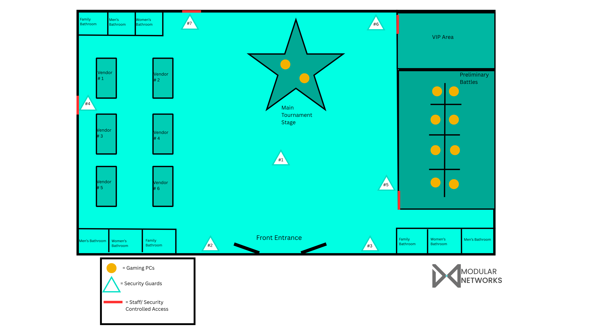
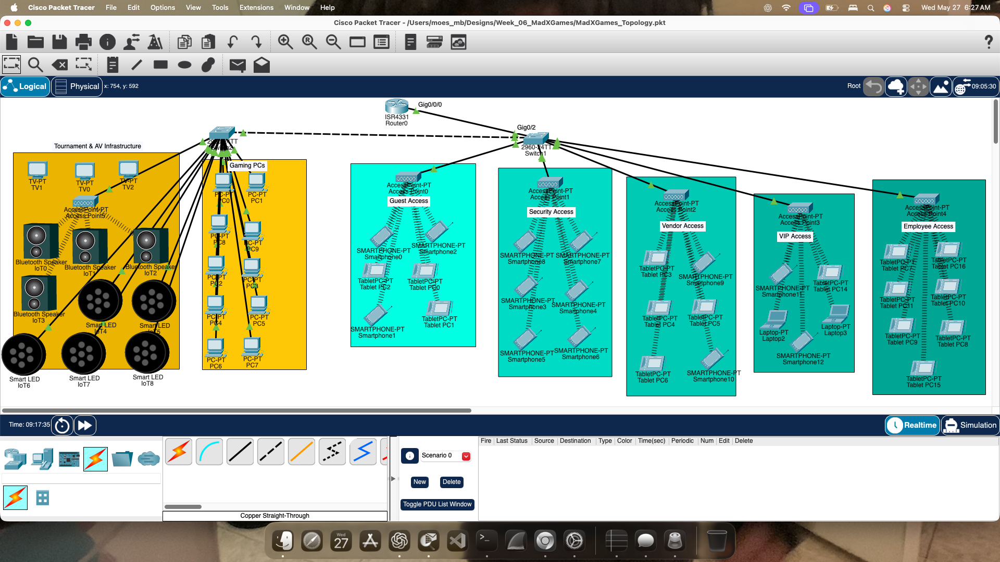
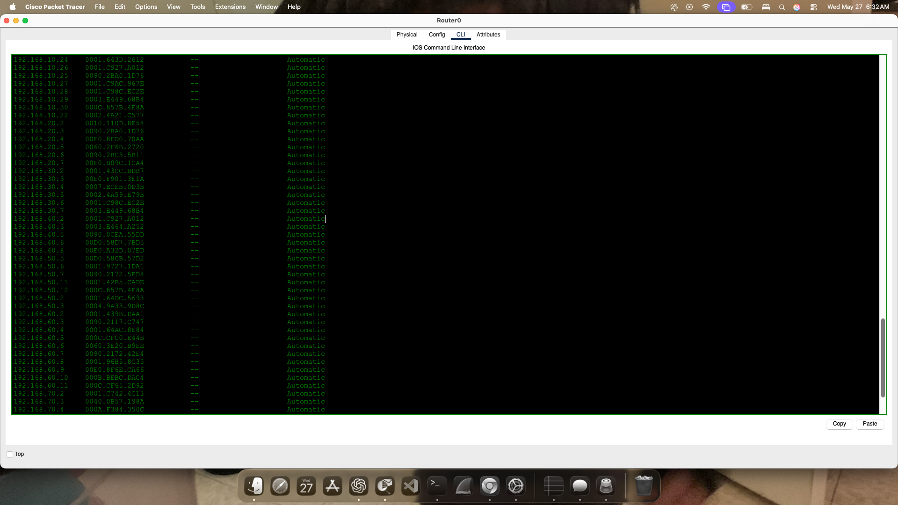
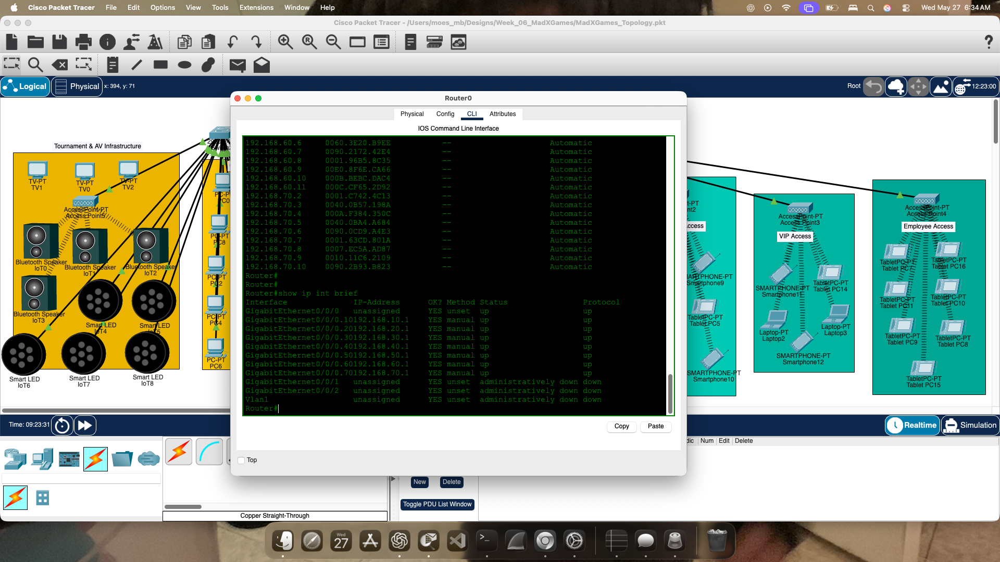
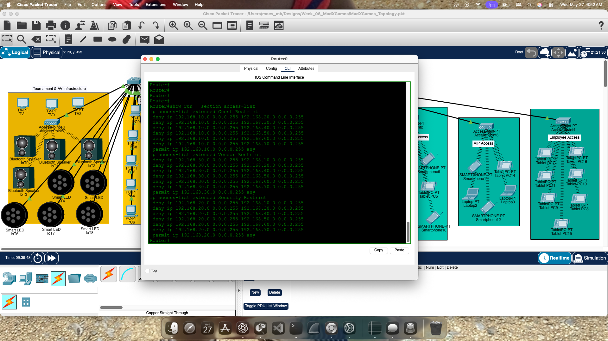
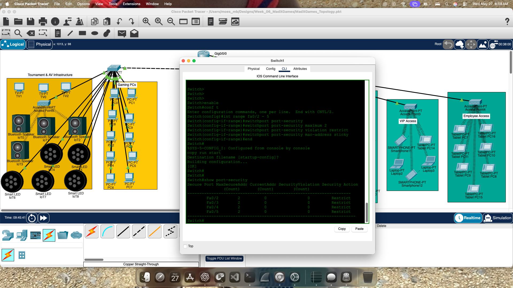

# Modular Networks – Gaming Expo Infrastructure Design

## Overview

This project showcases a segmented gaming expo infrastructure designed for a large-scale esports and entertainment convention.

The environment was built to simulate real-world event operations, including guest access control, vendor segmentation, VIP isolation, tournament infrastructure, and staff/security movement management.

---

## Objectives

- Separate public and internal event traffic
- Protect tournament infrastructure from guest access
- Isolate vendor and employee operations
- Restrict lateral movement across VLANs
- Simulate secure access-controlled event operations
- Implement port security and unused port shutdowns

---

## Network Segmentation

| VLAN | Purpose |
|------|---------|
| VLAN 10 | Guest Access |
| VLAN 20 | Security |
| VLAN 30 | Vendor |
| VLAN 40 | VIP / Competitors |
| VLAN 50 | Employee Access |
| VLAN 60 | Gaming PCs |
| VLAN 70 | Tournament & AV Infrastructure |

---

## Security Design

The network uses ACL enforcement to restrict unnecessary communication between VLANs.

Examples include:

- Guests restricted from internal networks
- Vendors isolated from tournament infrastructure
- Security segmented from VIP systems
- Unused switch ports administratively shut down
- Port security enabled on active access ports

---

## Infrastructure Zones

- Main Tournament Stage
- Preliminary Battle Stations
- VIP Area
- Vendor Hall
- Employee Operations
- Tournament AV Infrastructure
- Public Guest Wireless Access

---

## Technologies Used

- Cisco Packet Tracer
- VLAN Segmentation
- Router-on-a-Stick (ROAS)
- DHCP
- ACLs
- Port Security
- Administrative Port Shutdown
- Wireless Segmentation

---

## Floor Plan

---

## Screenshots

### Final Topology

### DHCP Lease Validation

### Subinterface Verification

### ACL Restrictions

### Port Security

---

## Conclusion

This project demonstrates how Modular Networks approaches event infrastructure design through segmentation, operational awareness, and layered security practices.

The focus extends beyond connectivity and into real-world venue operations, crowd movement, restricted access control, and infrastructure protection for high-density public environments.